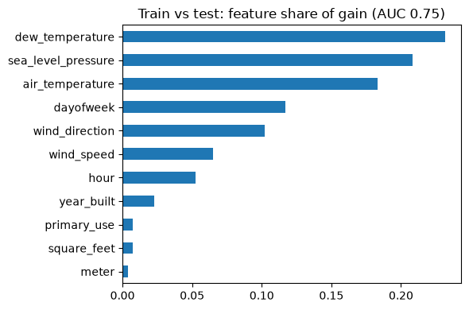
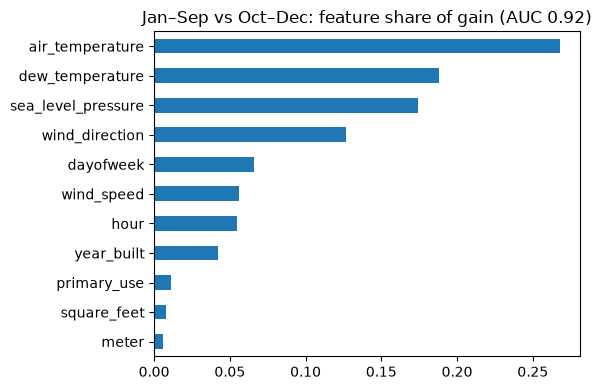
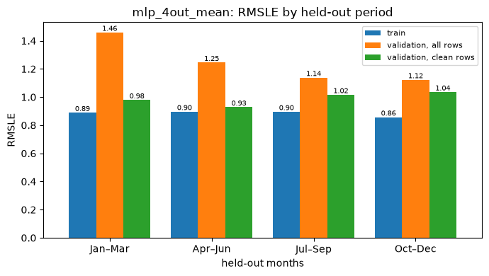
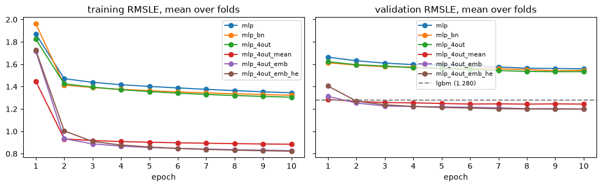
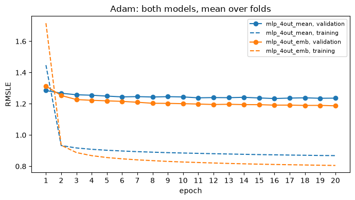
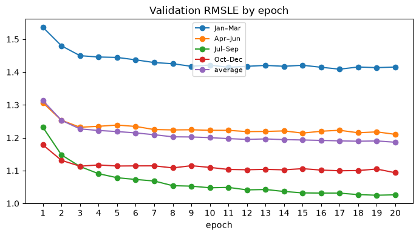
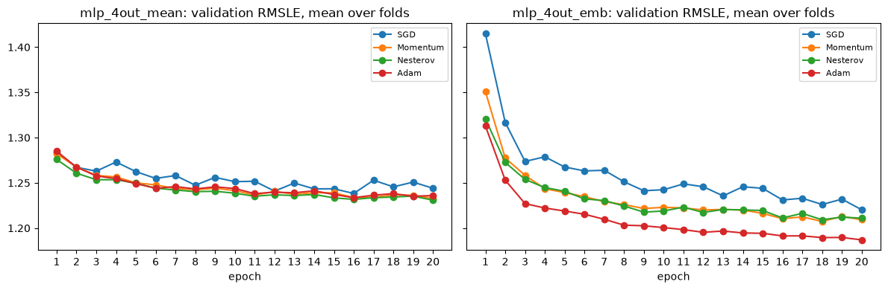
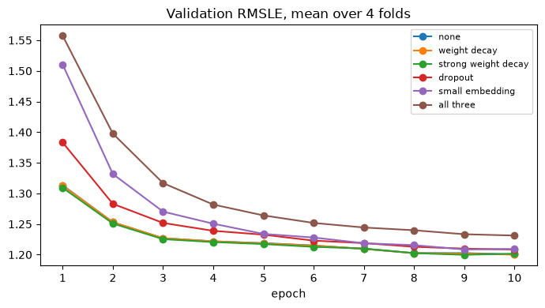
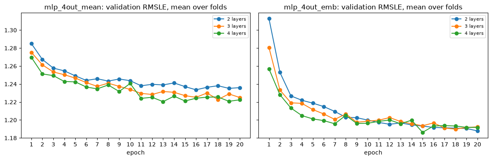
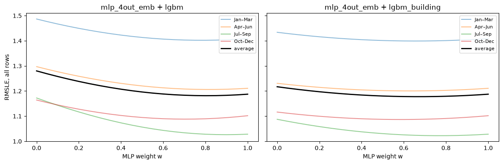

# ASHRAE Great Energy Predictor III

We predict hourly energy use of ~1,450 buildings at 16 sites for 4 meter types, scored with RMSLE ([EDA.ipynb](eda/EDA.ipynb)). The final submission is a blend of an MLP with building embeddings and LightGBM: 1.178 on our validation, 1.086 public and 1.302 private on Kaggle. Unless noted, every score below is an average over four seasonal folds of 2016 ([Validation Strategy](#validation-strategy)).

## Preprocessing

Careful performing of this process was inspired by three prior write-ups:

- a data-cleaning methodology from a top ASHRAE solution ([1](#references))
- an anomaly-correction approach from a BirdCLEF competition ([2](#references))
- site and building identification via internet search ([3](#references))

As a result, for Handout validation it seemed like a boost, but for 4-fold seasonal validation it is only a slight change ([mlp.ipynb, Findings](models/mlp.ipynb#follow-up)).

### Local time zone correction

As noted in the [competition forum](https://www.kaggle.com/c/ashrae-energy-prediction/discussion/115698), weather timestamps are UTC while meter timestamps are local. We confirmed it on our data: after shifting weather by each site's UTC offset, temperature peaks at 14:00–16:00 at every site. The exception is site 14, whose meters are in UTC too ([EDA §6.1](eda/EDA.ipynb#temporal)). The fix improved the LightGBM baseline from 1.290 to 1.286 (clean rows 1.147 → 1.140), and no fold got worse ([EDA §9](eda/EDA.ipynb#broken)).

### Remove anomalies

Some rows had broken energy use, like 0 energy use for some period, spikes, constant electricity use for some period of time, etc.

The decision was to remove zero electricity rows, zero heating rows for cold periods and zero chilled water during warm periods. Other anomalies do not matter so much ([EDA §9](eda/EDA.ipynb#broken)):

- zero electricity: every electricity reading of exactly 0, since a building always draws some power
- heating off when needed: steam or hot water at 0 for at least a week while the week's mean temperature is below 10 °C
- cooling off when needed: chilled water at 0 for at least a week while the week's mean temperature is above 20 °C

Together they flag 599,086 rows, 3.0% of the training data ([data_aggregation.ipynb §4](preprocessing/data_aggregation.ipynb)).

We drop them from training data only, while validating on all rows, because the Kaggle test set contains pathological data as well ([data_aggregation.ipynb §4](preprocessing/data_aggregation.ipynb)).

With a LightGBM baseline, dropping zero electricity alone improved RMSLE on clean rows from 1.140 to 1.061, and both rules together to 1.048 ([EDA §9](eda/EDA.ipynb#broken)). Shorter cut-offs worked better: requiring a zero run of 30 days gave 1.095, a week 1.075, a day 1.067 and dropping every zero 1.061, so even a few hours of zeros hurt.

On all rows, as Kaggle scores, the average barely moves: 1.286 → 1.281. Jul–Sep and Oct–Dec improve, Jan–Mar and Apr–Jun get worse (1.363 → 1.485, 1.187 → 1.301). Those two folds have the most anomalies in validation and still improve on clean rows. So the loss is on the anomaly rows: a model trained on a broken meter's zeros predicts low values, which pays off when the outage continues into the validation months ([EDA §9](eda/EDA.ipynb#broken)). We keep dropping anomalies. Whether 2016's outages continue into the test years could be checked by submitting models trained with and without the rules.

### Removed features

Some features just were not appropriate for training a model:

- floor count, which is missing for 83% of rows ([data_aggregation.ipynb §3](preprocessing/data_aggregation.ipynb))
- precipitation and cloud coverage, which barely relate to the target and are often missing ([EDA §7](eda/EDA.ipynb#relationships))

### Interpolated features

- year_built, filled with the training median, plus a missing flag: it is missing for 60% of rows ([data_aggregation.ipynb §3](preprocessing/data_aggregation.ipynb), [mlp.ipynb, Features](models/mlp.ipynb)).
- air / dew temperature and sea level pressure were interpolated linearly over time within each site. Up to 330 hours are missing at a site, so each site is first put on a full hourly grid. A site with no data at all for a column (site 5 never reports pressure) gets the mean of the other sites at the same hour ([data_aggregation.ipynb §2](preprocessing/data_aggregation.ipynb)).
- wind direction represented as sin/cos, then interpolated linearly ([mlp.ipynb, Features](models/mlp.ipynb))

### Feature Engineering

The features are built the same way for training, validation and test rows ([ashrae/features.py](ashrae/features.py)):

- `log1p(square_feet)`: floor area is the strongest building feature (Spearman ρ = 0.68 with the target for electricity) and is bell-shaped on a log scale ([EDA §4, §7](eda/EDA.ipynb#relationships)).
- Weather: air and dew temperature, sea level pressure, wind speed and wind direction as sin/cos. Temperature pushes chilled water up (ρ = 0.43) and steam and hot water down (ρ ≈ −0.45) ([EDA §7](eda/EDA.ipynb#relationships)).
- Cyclic encoding of hour and day of week (sin/cos), from local time ([mlp.ipynb, Features](models/mlp.ipynb)).
- One-hot `meter` and `primary_use` ([ashrae/features.py](ashrae/features.py)).
- Building identity, as either a learned 16-number vector per building (embedding) or the mean `log1p` reading of each building x meter series ([mlp.ipynb, Models](models/mlp.ipynb)).

### Target transformations

- RMSLE is the RMSE of `log1p` values, so we predict `log1p(meter_reading)` with an MSE loss, which optimizes the metric directly ([EDA §8](eda/EDA.ipynb#metric)). Moreover, log1p of meter reading has a bell shape, which is generally a good sign.
- Predictions are clipped at 0, since readings can't be negative ([ashrae/modeling.py](ashrae/modeling.py)).
- Site 0 electricity is converted from kBTU to kWh for training (908,409 rows), and back for the submission ([data_aggregation.ipynb §1](preprocessing/data_aggregation.ipynb)).

### Adversarial validation

Adversarial validation found no feature to drop. A LightGBM classifier tells 2016 from 2017–2018 with AUC 0.75, but only 0.52 without weather, and each weather feature alone scores 0.51–0.54 ([adversarial.ipynb §1](validation/adversarial.ipynb)).

Together the weather features effectively act like a timestamp fingerprint, so this leak is not actually exploitable. The feature importances show it: nearly all the gain comes from weather and calendar features, almost none from building features.



## EDA and Metric analysis

### Data insights

- 20.2M hourly readings from 2,380 building x meter series; 875 of 1,449 buildings have only one meter, almost always electricity ([eda_expl.md](eda/eda_expl.md)).
- The target is extremely skewed: one steam meter (building 1099) holds 78% of all energy. On a log scale it is well-behaved ([eda_expl.md](eda/eda_expl.md)).
- Zeros are common: 27% of hot water readings, 16% of chilled water, 13% of steam and 4% of electricity ([eda_expl.md](eda/eda_expl.md)).
- Chilled water peaks in summer, steam and hot water in winter. Use is lower at night and at weekends ([eda_expl.md](eda/eda_expl.md)).

### Metric

The metric measures relative error: a 10% miss costs about 0.095 at any scale. It is harsh near zero, though: predicting 5 for a true 0 costs 1.79 ([EDA §8](eda/EDA.ipynb#metric)).

Strengths:

- relative error, so the few huge series don't dominate
- it's plain MSE on the `log1p` target, so the training loss is the metric

Weaknesses and edge cases:

- zeros cost a lot, and many zeros come from broken meters, so the score partly measures whether a model predicts outages, not energy use
- it ignores whether errors cancel out over a day or a year, and a miss on a 10 kWh meter costs as much as the same relative miss on a 10 MWh one
- negative predictions are undefined (we clip at 0)
- a unit mix-up is a large constant error: site 0 electricity is scored in kBTU, 3.4x the kWh value ([data_aggregation.ipynb §1](preprocessing/data_aggregation.ipynb))

Complementary metrics we track next to RMSLE on all rows:

- RMSLE on clean rows (without anomalies): the error on real consumption, separated from broken meters ([season_validation.ipynb](validation/season_validation.ipynb))
- RMSLE per meter type: electricity and hot water differ by 0.6, so an average hides where a model fails ([mlp.ipynb, Results](models/mlp.ipynb))
- spread over the four folds: a change has to help in at least 3 of 4 seasons, not only on average ([layers_test.ipynb](models/layers_test.ipynb))
- residual correlation between models, which shows how much an ensemble can gain ([ensemble.ipynb](models/ensemble.ipynb))

Alternative target metric: CV(RMSE) per building x meter series, averaged over series. The competition's purpose is to estimate energy savings after building retrofits, which needs errors in kWh, not ratios. ASHRAE Guideline 14, the standard for that measurement, uses CV(RMSE), the RMSE divided by the mean reading. Computing it per series and then averaging keeps the few largest buildings from dominating, and it doesn't explode on zero readings the way RMSLE does. We haven't computed it on our models.

## Validation Strategy

### Handout approach (failed)

The first split trained on Jan–Sep and validated on Oct–Dec ([mlp.ipynb, Data](models/mlp.ipynb)). The problem was that adversarial validation showed the two parts are told apart with AUC 0.92, all from weather features ([adversarial.ipynb §2](validation/adversarial.ipynb)).



### Seasonal 4-Fold

From then on we used four folds: each holds out one 3-month block of 2016 and trains on the other nine months, with 2M training and 500K validation rows sampled per fold. Settings are compared by the mean over the folds ([adversarial.ipynb, How to use this](validation/adversarial.ipynb); folds are defined in [ashrae/config.py](ashrae/config.py#L19)). Training on months after the validation block is acceptable here, because the test set is a later year with known weather.

Each fold is scored twice: on all rows, as Kaggle scores, and on clean rows without anomalies, which measures the error on real consumption ([season_validation.ipynb](validation/season_validation.ipynb)). This explained the large spread between seasons ([season_validation.ipynb, Findings](validation/season_validation.ipynb); [mean_vs_embedding.ipynb](validation/mean_vs_embedding.ipynb) for the embedding model):

- on all rows, validation ranges from 1.12 (Oct–Dec) to 1.46 (Jan–Mar), in the same order as the anomaly share (1.1% → 6.1%)
- on clean rows it's 0.93–1.04
- for the final MLP, of the gap between training (0.83) and validation (1.20), 0.26 is anomaly rows in validation and only 0.11 is season plus memorization



### Expected correlation with the leaderboard

The test set is 2017–2018 for the same buildings, with weather given.

Why the correlation should be high:

- the four folds together cover every season, as the two full test years do
- train and test differ in weather only: without weather features the adversarial AUC is 0.52, about chance ([adversarial.ipynb §1](validation/adversarial.ipynb))
- validation is scored on all rows, anomalies included, as Kaggle scores the test set

Why it may be low:

- broken meters decide much of the score: 1.1% → 6.1% anomaly rows moves RMSLE from 1.12 to 1.46, so the leaderboard depends on how many outages 2017–2018 has, which we can't see ([season_validation.ipynb](validation/season_validation.ipynb))
- buildings change over 1–2 years (renovations, new equipment, changes in use), and the embedding learned on 2016 can't know that
- the folds interpolate within 2016, while the test years lie entirely after it

### Leaderboard results

| Submission | Local validation | Public | Private |
| --- | --- | --- | --- |
| lgbm_building ([submission_baseline.ipynb](models/submission_baseline.ipynb)) | 1.217 | 1.110 | 1.318 |
| blend, 0.65 · mlp_4out_emb + 0.35 · lgbm_building ([submission.ipynb](models/submission.ipynb)) | 1.178 | 1.086 | 1.302 |

- The folds rank the two models correctly: the blend beats lgbm_building locally and on both leaderboard parts. The margin is smaller on the leaderboard (0.024 public, 0.016 private) than locally (0.039).
- The offset is consistent: both submissions score about 0.1 better than validation on public and 0.10–0.12 worse on private.
- Public and private differ by about 0.21 for both models, more than any change we made after giving the model the building identity. Private is worse, as expected when the test years lie after 2016. Both parts are within the range of our own folds (1.03–1.40 for the blend), so the gap is the size of the gap between seasons.

Two submissions show that the ranking holds for this pair, not in general.

## Models

Empirically we established that the best performing model is a modified MLP with 4 outputs, one for each meter, and embeddings for buildings.

All networks are trained by one PyTorch Lightning module and logged to MLflow ([mlp.ipynb, Frameworks](models/mlp.ipynb#frameworks)). We built the model up one change at a time, 10 epochs each ([mlp.ipynb, Results](models/mlp.ipynb)):

| Model | Change | RMSLE, all rows | RMSLE, clean rows |
| --- | --- | --- | --- |
| mlp | 2 hidden layers of 64, ReLU, Adam | 1.559 | 1.380 |
| mlp_bn | + BatchNorm | 1.546 | 1.368 |
| mlp_4out | + one output per meter type | 1.534 | 1.350 |
| mlp_4out_mean | + series mean input | 1.244 | 0.994 |
| mlp_4out_emb | + building embedding instead | 1.200 | 0.938 |
| lgbm | LightGBM, untuned, same features | 1.280 | 1.045 |



The curves split into two groups: networks that know the building drop to ~0.85 training and ~1.20 validation RMSLE within 2–3 epochs, the rest stay above 1.3 and 1.5.

- Knowing the building matters most: 1.534 → 1.244 with the series mean, 1.200 with the embedding. Both beat LightGBM in every fold. Buildings with the same size, use and weather differ in consumption by orders of magnitude ([mlp.ipynb, Findings](models/mlp.ipynb#follow-up)).
- Architecture tweaks help a little: BatchNorm improves every fold, and one output per meter type improves 3 of 4. Both gains are around 0.01, close to seed noise.
- The embedding beats the series mean in every season, 0.943 vs 0.990 on clean rows. The gain is in heating and cooling (chilled water 0.078, steam 0.090, electricity 0.009): the embedding can learn how a building reacts to weather, the mean only gives its average level ([mean_vs_embedding.ipynb](validation/mean_vs_embedding.ipynb)).
- Optimizer: Adam. It averaged 1.213 over both building-aware models, against 1.223 for Momentum and Nesterov and 1.237 for plain SGD, and it's best in every fold ([optimizers_test.ipynb](models/optimizers_test.ipynb)).
- Epochs: 20. Validation keeps improving up to the last epoch tested: 1.219 at 5 epochs, 1.200 at 10, 1.186 at 20 ([epochs_test.ipynb](models/epochs_test.ipynb)).
- Depth: 2 hidden layers. 3 and 4 layers don't help the embedding model (1.188 → 1.192); they only fit the training rows a little better and converge faster. A deeper network had to gain more than 0.01 on at least 3 of 4 folds, a rule fixed before running ([layers_test.ipynb](models/layers_test.ipynb)).
- Hot water is hardest: 1.57 against 0.95 for electricity on all rows ([mlp.ipynb, Results](models/mlp.ipynb)).

### Chosen hyperparameters

| Setting | mlp_4out_emb | Where it was chosen |
| --- | --- | --- |
| Hidden layers | 2 x 64, Linear → BatchNorm → ReLU | [mlp.ipynb](models/mlp.ipynb), [layers_test.ipynb](models/layers_test.ipynb) |
| Outputs | 4, one per meter type; each row uses its meter's output | [mlp.ipynb](models/mlp.ipynb) |
| Building embedding | 16 numbers per building (4 was worse) | [regularization_test.ipynb](models/regularization_test.ipynb) |
| Optimizer | Adam (AdamW with weight decay 0), learning rate 1e-3 | [optimizers_test.ipynb](models/optimizers_test.ipynb) |
| Batch size | 4096 | [ashrae/modeling.py](ashrae/modeling.py) |
| Epochs | 20 | [epochs_test.ipynb](models/epochs_test.ipynb) |
| Dropout, weight decay | none | [regularization_test.ipynb](models/regularization_test.ipynb) |
| Initialization | PyTorch default (He was the same) | [mlp.ipynb](models/mlp.ipynb#follow-up) |
| Loss | MSE on `log1p(meter_reading)` | [EDA §8](eda/EDA.ipynb#metric) |
| Input scaling | StandardScaler fitted on the training rows | [ashrae/modeling.py](ashrae/modeling.py) |
| Training rows | 2M per fold (4M didn't help) | [ensemble.ipynb](models/ensemble.ipynb) |
| Seed | 0 | [ashrae/tracking.py](ashrae/tracking.py) |

LightGBM (lgbm, lgbm_building): 500 trees, learning rate 0.1, 63 leaves, not tuned ([ensemble.ipynb](models/ensemble.ipynb)).

### Optimization curves

With the final setup (Adam, 20 epochs), validation falls fast for 3 epochs, then slowly until epoch 20. Training RMSLE stays ~0.4 lower all the time ([optimizers_test.ipynb](models/optimizers_test.ipynb)):



The fold average is still improving at epoch 20, which is why we train for 20 epochs and why early stopping had nothing to stop ([epochs_test.ipynb](models/epochs_test.ipynb)):



The optimizer, regularization and depth comparisons:







### Training logs (PyTorch Lightning + MLflow)

Every network is trained by one `LightningModule`, `EnergyModel` ([ashrae/modeling.py](ashrae/modeling.py)). Its `Trainer` logs through Lightning's `MLFlowLogger` ([ashrae/tracking.py](ashrae/tracking.py)). Each run records its settings (learning rate, batch size, epochs, number of inputs and, where varied, optimizer, weight decay, dropout, embedding size, depth and training rows) and training and validation RMSLE per epoch. The model-comparison runs also log validation RMSLE per meter type and on clean rows. All 260 runs are in [mlflow.db](mlflow.db):

| MLflow experiment | Runs | What it compares |
| --- | --- | --- |
| ashrae-mlp | 99 | model build-up, He initialization, LightGBM (14 runs); 41 runs are from the early Handout validation |
| ashrae-optimizers | 56 | SGD, Momentum, Nesterov, Adam |
| ashrae-regularization | 44 | weight decay, dropout, smaller embedding |
| ashrae-layers | 24 | 2, 3, 4 hidden layers |
| ashrae-mean-vs-emb | 16 | series mean vs embedding |
| ashrae-ensemble | 8 | MLP runs for the blend, 2M and 4M rows |
| ashrae-season-validation | 6 | train vs validation per season |
| ashrae-epochs | 4 | 20 epochs per fold |
| ashrae-submission | 3 | final MLP and LightGBM for the blend, LightGBM baseline submission |

Every run is tagged with its fold, model and notebook session. To browse them, run from the `Homework 1` folder and open <http://127.0.0.1:5000>:

```bash
poetry run mlflow ui --backend-store-uri sqlite:///mlflow.db
```

### Is the model adequate?

- LightGBM baseline is adequate as a reference, not as the final model. It scores 1.280 against 1.187 for the MLP and is behind in every fold. Given `building_id` it reaches 1.217, so its weakness is the missing building identity, not the method. It is untuned, so tuning could only improve on 1.217 ([ensemble.ipynb](models/ensemble.ipynb)). On Kaggle it is behind the blend on both parts ([Leaderboard results](#leaderboard-results)).
- mlp_4out_emb is adequate for the inputs it has. It beats LightGBM in every fold and in every meter type ([mlp.ipynb, Results](models/mlp.ipynb)). It isn't overfitting: regularization only hurts and validation still improves at epoch 20. It isn't short of capacity or data either, since more layers and twice the rows change nothing. What remains is anomaly rows in validation (0.26 of the 0.37 gap) and the season ([mean_vs_embedding.ipynb](validation/mean_vs_embedding.ipynb)). To improve, it needs new inputs, such as lagged and rolling weather, not a bigger network ([ensemble.ipynb, Recommendations](models/ensemble.ipynb)).

## Ensembling

We blend mlp_4out_emb with LightGBM as a weighted average of their `log1p` predictions, `w · mlp + (1 − w) · lgbm`, which keeps the blend in the space RMSLE measures. Both get the same 33 features ([ensemble.ipynb](models/ensemble.ipynb)).

It is a two-stage pipeline in its simplest form. Stage 1 trains both models on each fold and keeps their predictions on that fold's held-out months (out-of-fold predictions). Stage 2 fits the blend weight on those predictions, choosing it on three folds and scoring it on the fourth, so the ensemble is validated on rows neither stage has seen. Stage 2 has one parameter; a trained second-stage model (stacking) wasn't tried.



| Model | RMSLE, all rows | RMSLE, clean rows |
| --- | --- | --- |
| mlp_4out_emb | 1.187 | 0.924 |
| lgbm | 1.280 | 1.045 |
| lgbm_building (+ `building_id` as a categorical) | 1.217 | 0.959 |
| blend with lgbm | 1.183 | 0.919 |
| blend with lgbm_building | 1.178 | 0.911 |

- The blend helps a little, in every fold: 1.187 → 1.178 with lgbm_building. The chosen MLP weight is stable, 0.6–0.7 across folds.
- Telling LightGBM the building is worth 0.063 (1.280 → 1.217), but it still trails the MLP in every fold.
- The gain is small because the errors are alike: residuals correlate 0.88 with lgbm_building on clean rows. Both models miss the same rows, mostly anomalies and seasonal effects.
- It helps heating and cooling, not electricity: chilled water 1.374 → 1.350, steam 1.515 → 1.501, hot water 1.564 → 1.545, electricity unchanged at 0.941.

The final submission is 0.65 · mlp_4out_emb + 0.35 · lgbm_building, both retrained on 2M rows sampled from all of 2016 with anomalies dropped ([submission.ipynb](models/submission.ipynb)). It predicts all 41,697,600 test rows, and site 0 electricity is converted back to kBTU. On the test set the two models' `log1p` predictions correlate 0.976. Leaderboard scores are in [Leaderboard results](#leaderboard-results).

## Fails

- He initialization made no difference: 1.199 vs 1.200 for PyTorch's default, since BatchNorm re-normalizes every hidden layer ([mlp.ipynb](models/mlp.ipynb#follow-up)).
- Model regularization (except Batch Norm) did not help. Weight decay (0.01 or 0.1) changed nothing; dropout (1.208), a smaller embedding (1.209) and all three together (1.231) were worse than none (1.200). Most of the train–validation gap isn't overfitting ([regularization_test.ipynb](models/regularization_test.ipynb)).
- Early stopping had nothing to stop: validation still improved at the last epoch ([epochs_test.ipynb](models/epochs_test.ipynb)).
- MLP models and EDA were evaluated using Handout validation, while adversarial validation showed that the Jan–Mar period makes a huge difference, so we re-evaluated and re-analyzed the whole project. On Oct–Dec alone, dropout looked like a win (1.111 → 1.102) but lost on the other three seasons, the series mean looked tied with the embedding, and validation looked flat after epoch 9. It also overstated the anomaly rules: 1.383 → 1.168 there, 1.286 → 1.281 on the fold average.
- SGD-based optimizers: plain SGD changed 3–4x as much from epoch to epoch as the others, and Momentum and Nesterov were still behind Adam on the embedding model (1.211–1.212 vs 1.190) ([optimizers_test.ipynb](models/optimizers_test.ipynb)).
- More hidden layers didn't improve the embedding model (1.192 vs 1.188) ([layers_test.ipynb](models/layers_test.ipynb)).
- More training rows: 4M per fold instead of 2M gave 1.186 vs 1.187 for the MLP and 1.176 vs 1.178 for the blend, at twice the training time ([ensemble.ipynb](models/ensemble.ipynb)).
- Two more anomaly rules, stuck meters (the same non-zero value for 48+ hours) and spikes (more than 10x the daily median), changed the score by 0.003 at most while dropping another 0.8–1.5% of training rows. The spike rule mostly flagged normal on/off cycling ([EDA §9](eda/EDA.ipynb#broken)).

### Engineering mistakes

Scores in this list are from the Handout validation, which we used at the time.

- Weather gap-filling invented data: cloud coverage (50% missing) and precipitation (36% missing) were forward-filled, so much of each column was made up. Fix: dropped both columns.
- Some weather gaps were never filled: sites with a column missing for the whole year had nothing to fill from, and whole hours were missing from the weather file. Fix: fill pressure and wind from other sites for the same hour, and add the missing hours before interpolating.
- Weather was 5–8 hours out of step with the meters. Fix: shift weather to local time (1.395 → 1.385). The first plan shifted every site, but site 14's meters are also in UTC, so it is left unshifted.
- The model learned from broken meters. Fix: these rows are left out of training but still scored in validation. Dropping every zero electricity reading worked better than the first "zero for a week" rule; with the heating and cooling rule this gave 1.395 → 1.164.
- The MLP could not tell buildings apart and lost to LightGBM (1.524 vs 1.392), which could pick out buildings by their floor area. Fix: give the MLP a building identity, either the series mean or an embedding.
- Results went stale after the data changed. Fix: re-ran models and adversarial validation, and every MLP improved by 0.11–0.26.
- The train–validation gap was misdiagnosed twice: first as overfitting, then as seasons. In fact, most of it comes from anomaly rows in validation. Lesson: read the learning curves before choosing a fix.
- Optimizers were ranked on noise: the last epoch's score depended on epoch-to-epoch swings. Fix: rank by the mean of the last 5 epochs.
- The submission came from the wrong model, a weaker one trained on 9 months. Fix: it now uses the best model, trained on the full year.

## AI usage

AI tools helped write parts of the code and the reports. The full transcripts of these sessions are in [ai usage/](ai%20usage/).

## References

1. 1st Place Solution in "ASHRAE Great Energy Predictor III" by Isamu & Matt — <https://www.kaggle.com/competitions/ashrae-energy-prediction/writeups/isamu-matt-1st-place-solution-team-isamu-matt>
2. "1st place solution: Correct Data is All You Need" by Volodymyr, "BirdCLEF 2023" competition — <https://www.kaggle.com/competitions/birdclef-2023/writeups/volodymyr-1st-place-solution-correct-data-is-all-y>
3. "Sites, buildings identified by internet search" for "ASHRAE Great Energy Predictor III" by Poe Dator — <https://www.kaggle.com/c/ashrae-energy-prediction/discussion/112841>
